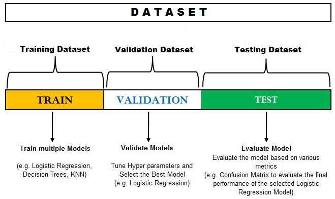

# Cross Validation

Trying different cross validation techniques and when to use them

## Hold-out set

The validation set which is a hold-out set from the training set i.e. a portion of training set kept aside is then used to optimize the hyper-parameters of the models and evaluate the model. Thus, the validation set is used to tune the various hyper-parameters and select the best performing algorithm. However, to fully determine that the selected algorithm is correct we apply the model to the training dataset. This is done because as when we tune the hyper-parameters based on the validation set, we end up slightly overfitting our model based on the validation set. Thus, the accuracy we receive from the validation set is not considered final and another hold-out dataset which is the test dataset is used to evaluate the final selected model and the error found here is considered as the generalisation error.

The notebook show an example of using this technique on the wine quality data set.

