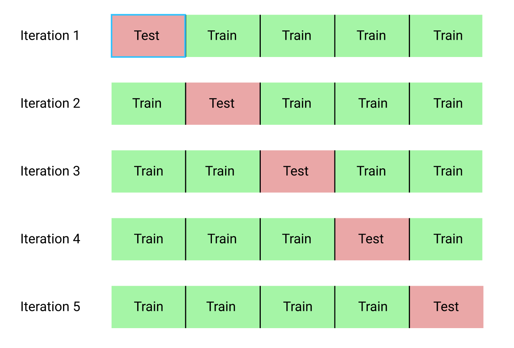

# Cross Validation

Trying different cross validation techniques and when to use them

## Hold-out set

The validation set which is a hold-out set from the training set i.e. a portion of training set kept aside is then used to optimize the hyper-parameters of the models and evaluate the model. Thus, the validation set is used to tune the various hyper-parameters and select the best performing algorithm. However, to fully determine that the selected algorithm is correct we apply the model to the training dataset. This is done because as when we tune the hyper-parameters based on the validation set, we end up slightly overfitting our model based on the validation set. Thus, the accuracy we receive from the validation set is not considered final and another hold-out dataset which is the test dataset is used to evaluate the final selected model and the error found here is considered as the generalisation error.

The notebook show an example of using this technique on the wine quality data set.

## KFold Cross Validation

The procedure has a single parameter called k that refers to the number of groups that a given data sample is to be split into. As such, the procedure is often called k-fold cross-validation. When a specific value for k is chosen, it may be used in place of k in the reference to the model, such as k=10 becoming 10-fold cross-validation.

### The general procedure is as follows:
1. Shuffle the dataset randomly.
2. Split the dataset into k groups
3. For each unique group:
    1. Take the group as a hold out or test data set
    2. Take the remaining groups as a training data set
    3. Fit a model on the training set and evaluate it on the test set
4. Retain the evaluation score and discard the model
5. Summarize the skill of the model using the sample of model evaluation scores

## Stratified KFold Cross Validation

Stratified k-fold cross-validation is same as just k-fold cross-validation, But in Stratified k-fold cross-validation, it does stratified sampling instead of random sampling. We use this approach when the dataset is skewed.
#### Stratified Sampling:
 split a dataset randomly, although in such a way that maintains the same class distribution in each subset.and the target variable (y), the class, is used to control the sampling process.this will enforce the class distribution in each split of the data to match the distribution in the complete training dataset.
